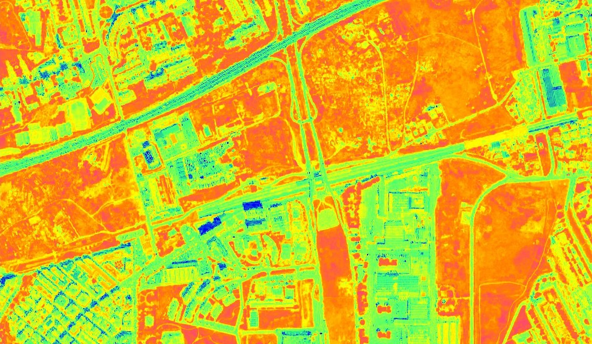

## Evaluate and visualize

As Airbus Pleiades is commercial data, brought into Sentinel Hub as Bring Your Own Data, direct EO Browser and Sentinel Playgorund links are not possible due to the personalized data credentials. 

## General description of the script

The NDWI is useful for water body mapping, as water bodies strongly absorb light in visible to infrared electromagnetic spectrum. NDWI uses green and near infrared bands to highlight water bodies. It is sensitive to built-up land and can result in over-estimation of water bodies.

**NDWI = (B1 - B3) / (B1 + B3)**

Values description: Index values greater than 0.5 usually correspond to water bodies. Vegetation usually corresponds to much smaller values and built-up areas to values between zero and 0.2.

## Description of representative images

NDWI (for water content in leaves) of Rome. 

## References
Source: https://en.wikipedia.org/wiki/Normalized_difference_water_index
