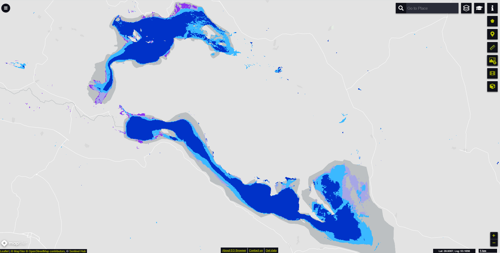

# Global Water Bodies Occurrence visualisation script


<button class="btn btn-primary" id="toggle-script" onclick="toggleScript()">Show Script</button>
[Download Script](script.js){: .btn target="_blank" download="{{paths | append: ".js"}}"}
{: .mt-lg-4 }

 




## General description of the script  
This script visualizes Water Bodies Occurence  derived from Quality layer (QUAL) in the Water Bodies data.The occurrence values rank from low occurrence to permanent occurrence. The Water Bodies Occurrence values and color legend are shown in the table below:
 
Table 1: Color legend for the Water Bodies Occurrence
<table>
  <thead>
    <tr>
      <th>Value</th>
      <th>Color</th>
	    <th>Label</th>
    </tr>
  </thead>
  <tbody>
    <tr>
      <td>71 </td>
      <td style="background-color:#ff0000"></td>
	    <td> Very low Occurrence </td>
    </tr>
    <tr>
      <td>72</td>
      <td style="background-color:#8e35ef"></td>
	    <td> Low Occurrence </td>
    </tr>
    <tr>
      <td>73</td>
      <td style="background-color:#a6a6e6"></td>
	    <td>  Medium Occurrence </td>
    </tr>
    <tr>
      <td>74</td>
      <td style="background-color:#00ffff" ></td>
	    <td>  High Occurrence </td>
    </tr>
    <tr>
      <td>75</td>
      <td style="background-color:#3bb9ff" ></td>
	    <td> Very high Occurrence </td>
    </tr>
    <tr>
      <td>76</td>
      <td style="background-color:#0032c8"></td>
	    <td> Permanent Occurrence </td>
    </tr>  
    <tr>
      <td>251</td>
      <td></td>
	    <td> No data </td>
    </tr>
  </tbody>
</table>  

## Description of representative images

*December 2020 water bodies occurrence on Iran's second largest salt lake Bakhtegan and lake Tashk visualised in EO browser*  

## Resources

- [Data Source](https://land.copernicus.vgt.vito.be/PDF/portal/Application.html#Browse;Root=514888;Collection=1000152;Time=NORMAL,NORMAL,-1,,,-1,,)

- [Entry in public collections](https://github.com/sentinel-hub/public-collections/tree/main/collections/water-bodies)
