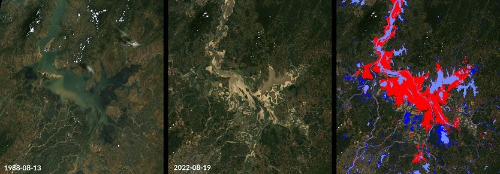
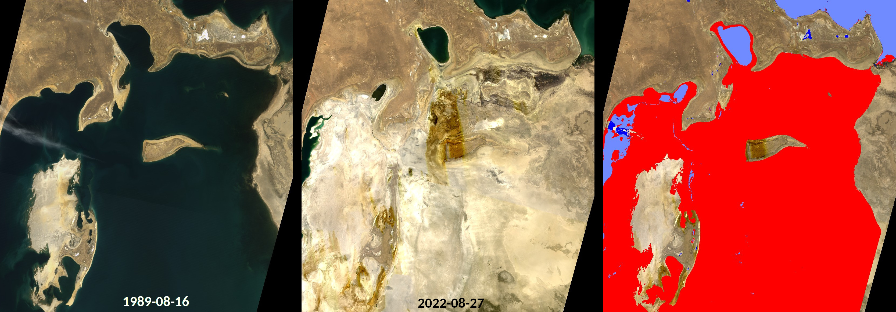
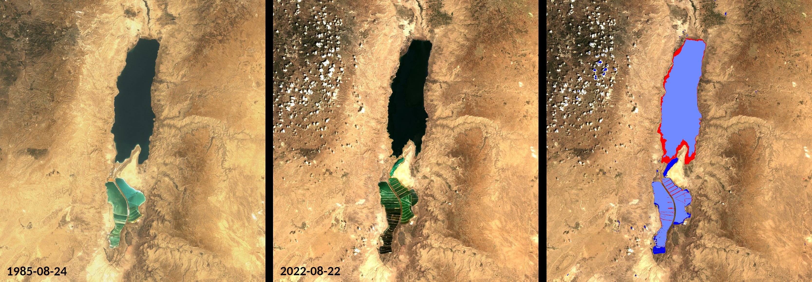

# Detection of Lake Extent Changes
  

<button class="btn btn-primary" id="toggle-script" onclick="toggleScript()">Show Script</button>
[Download Script](script.js){: .btn target="_blank" download="{{paths | append: ".js"}}"}
{: .mt-lg-4 }

 




  
## Evaluate and visualize  
 - [EO Browser - Poyang Lake](https://sentinelshare.page.link/rLrD) 

## Data sources used
- Landsat 8-9 Level 2
- Landsat 4-5 Level 2
  
## General description of the script  

Climate change contributes to more frequent or more severe droughts and floods in many regions of the world, among other things. Satellite Earth observation is extremely useful to document these changes, for example by monitoring water bodies. The Landsat program provides particularly useful data for demonstrating variations in the extent of lakes over the last decades, for example, as it provides the longest-running record of satellite observations since the 1970s.

This script is a custom script for the Sentinel Hub EO Browser. It maps the extent of water bodies in two Landsat images defined by the user and then visualizes the changes between both scenes. The script is able to compare images both from the Landsat 8-9 Level-2 (available since 02-2013) and Landsat 4-5 TM Level-2 data sets, which together range from 07-1984 to 05-2012.

**Limitations**

The script currently only compares two single Landsat images which have to be selected manually for the area of interest. A multi-temporal approach which automatically composes water body masks from multiple images is not implemented yet. Also, the water body detection is simply performed using a MNDWI (Modified Normalized Difference Water Index) threshold [2]. This does not feature masking of clouds, snow or buildings, or other more advanced methods for a more accurate water body detection. Some of these have been previously implemented in [a script by Mohor Gartner](https://github.com/sentinel-hub/custom-scripts/tree/master/sentinel-2/water_bodies_mapping-wbm).

**How to use the script**

 1. Find two dates with suitable Landsat 4-5 TM or Landsat 8-9 records that you would like to compare.
 2. Load the scene of the later date in the EO Browser.
 3. Tick "Use additional datasets". Set the primary Datasource alias to "ds2" and the additonal Datasource alias to "ds1". 
 4. For the additional Datasource tick "Customize timespan" and set both fields to the date of the older scene.
 5. In the script, set date1 and date2 to match the dates of the scenes that shall be compared.
 6. Run the script. (“Refresh Evalscript”)

## Description of representative images 

**Example 1: Lake Poyang**

As an example, the pictures below show the Poyang Lake in August 1988 and 2022 as well as the lake extent changes detected by the presented script. The Poyang Lake is China’s largest freshwater lake and experiences significant lake level variations between the dry and the wet monsoon seasons. However, it experienced an extreme shrinkage in 2022 associated with a severe drought and heat wave in Southern China [1]. Red and dark blue colors indicate retraction or expansion of the detected water bodies from the older to the more recent image, respectively. 

Landsat images of Lake Poyang on 1988-08-13 (left, Landsat 4-5-TM Level-2 True Color Image) and on 2022-08-19 (middle, Landsat 8-9 Level-2 True Color Image). 
The rightmost panel shows changes in the water body extent between both scenes detected by the presented script.(Red / Dark Blue: detected water body receded / expanded. Light Blue: water detected in both scenes.)
   

[See high resolution version](https://github.com/JanLandwehrs/LakeExtentChangeDetection_SentinelHub-ScriptContest/blob/main/PoyangLake_1988-2022_LandsatImages.jpg)

**Exaple 2: Aral Sea**

Changes in Aral Sea water body extent between 1985-08-24 and 2022-08-22.

[See high resolution version](https://github.com/JanLandwehrs/LakeExtentChangeDetection_SentinelHub-ScriptContest/blob/main/AralSea_1989-2022_LandsatImages.jpg)

**Example 3: Dead Sea**

Changes in Dead Sea water body extent between 1989-08-16 and 2022-08-27. 

[See high resolution version](https://github.com/JanLandwehrs/LakeExtentChangeDetection_SentinelHub-ScriptContest/blob/main/DeadSea_1985-2022_LandsatImages.jpg)

## Author of the script

- Jan Landwehrs

## Credits

The presented script was inspired by the [water body detection script](https://github.com/sentinel-hub/custom-scripts/tree/master/sentinel-2/water_bodies_mapping-wbm) by Mohor Gartner.

## References

- [1] NASA Earth Observatory 2022, [Parched Poyang Lake](https://earthobservatory.nasa.gov/images/150285/parched-poyang-lake)
- [2] Hanqiu Xu 2006, [Modification of normalised difference water index (NDWI) to enhance open water features in remotely sensed imagery](https://doi.org/10.1080/01431160600589179)
