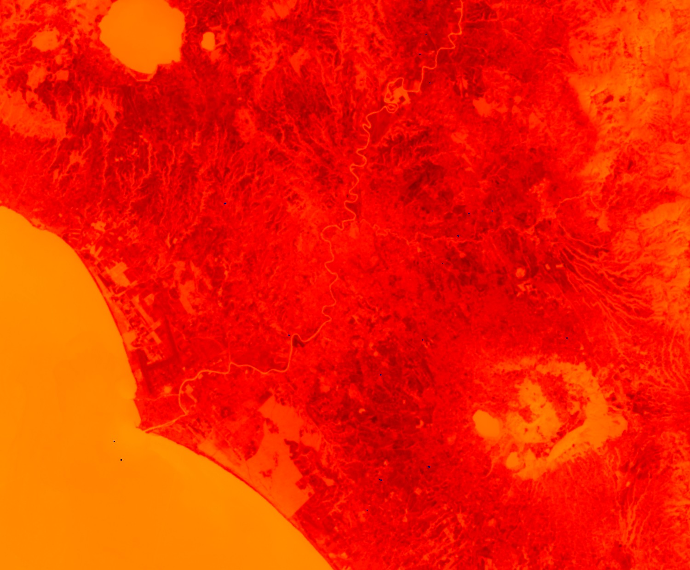

# Thermal Visualization

<button class="btn btn-primary" id="toggle-script" onclick="toggleScript()">Show Script</button>
[Download Script](script.js){: .btn target="_blank" download="{{paths | append: ".js"}}"}
{: .mt-lg-4 }

 




## Evaluate and visualize

- [EO Browser](https://apps.sentinel-hub.com/eo-browser/?zoom=12&lat=41.72239&lng=13.15132&themeId=DEFAULT-THEME&visualizationUrl=https%3A%2F%2Fservices.sentinel-hub.com%2Fogc%2Fwms%2Fa10a1628-76ea-4654-8961-6494cb74576d&evalscript=Ly9WRVJTSU9OPTMKbGV0IG1pblZhbCA9IC01MDsKbGV0IG1heFZhbCA9IDUwOwoKbGV0IHZpeiA9IENvbG9yR3JhZGllbnRWaXN1YWxpemVyLmNyZWF0ZUJsdWVSZWQobWluVmFsLCBtYXhWYWwpOwoKZnVuY3Rpb24gZXZhbHVhdGVQaXhlbChzYW1wbGVzKSB7CiAgICBsZXQgdmFsID0gc2FtcGxlcy5UaGVybWFsSW5mcmFyZWQxOwogICAgdmFsID0gdml6LnByb2Nlc3ModmFsKTsKICAgIHZhbC5wdXNoKHNhbXBsZXMuZGF0YU1hc2spOwogICAgcmV0dXJuIHZhbDsKfQoKZnVuY3Rpb24gc2V0dXAoKSB7CiAgcmV0dXJuIHsKICAgIGlucHV0OiBbewogICAgICBiYW5kczogWwogICAgICAgICJUaGVybWFsSW5mcmFyZWQxIiwKICAgICAgICAiZGF0YU1hc2siCiAgICAgIF0KICAgIH1dLAogICAgb3V0cHV0OiB7CiAgICAgIGJhbmRzOiA0CiAgICB9CiAgfQp9&datasetId=AWS_HLS&fromTime=2023-04-19T00%3A00%3A00.000Z&toTime=2023-04-19T23%3A59%3A59.999Z&demSource3D=%22MAPZEN%22#custom-script)

## Description

This thermal visualization is based on band ThermalInfrared1. At the central wavelength of 10895 nm it measures in the thermal infrared, or TIR. Instead of measuring the temperature of the air, like weather stations do, band ThermalInfrared1 reports on the ground itself, which is often much hotter.

## Description of representative images

HLS thermal visualization of Rome. Acquired on 2020-07-30, processed by Sentinel Hub. 

 