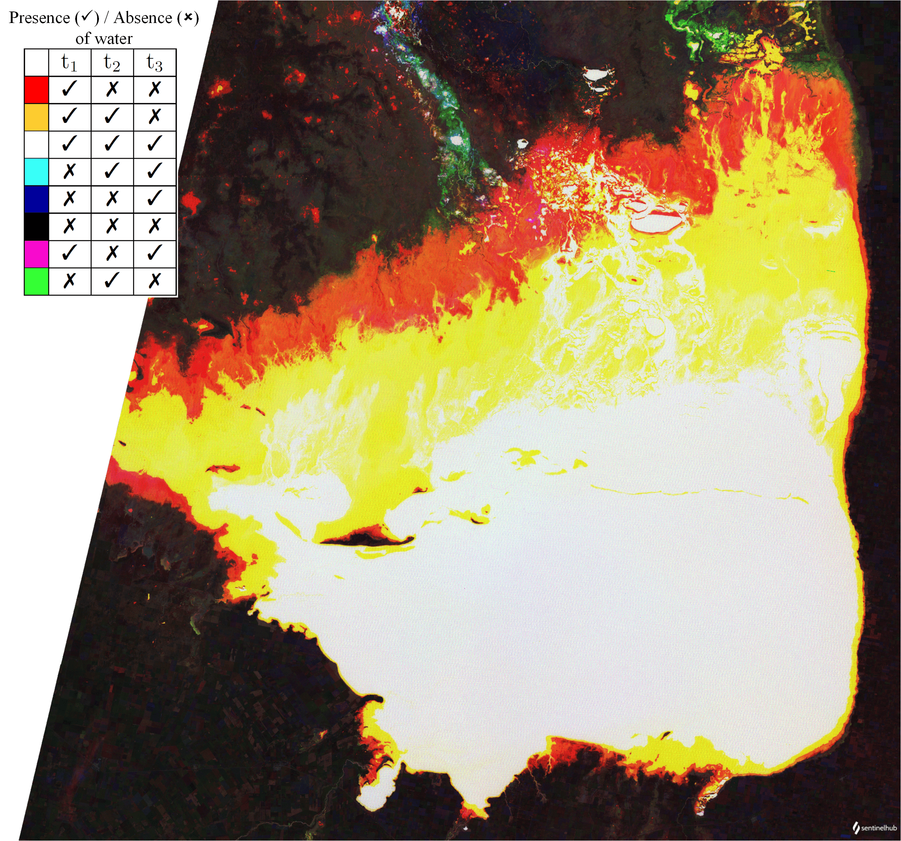
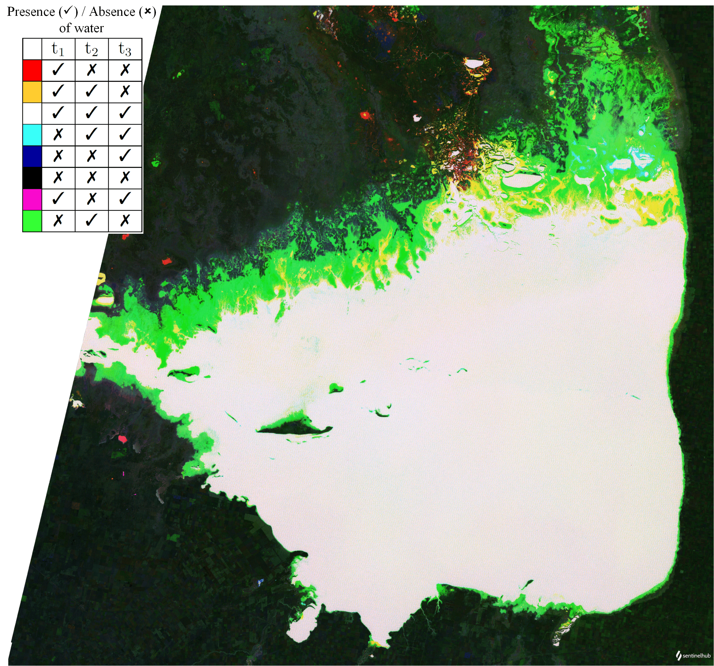
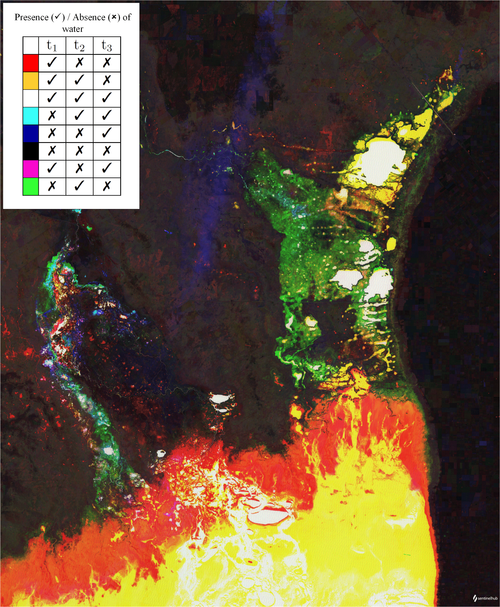
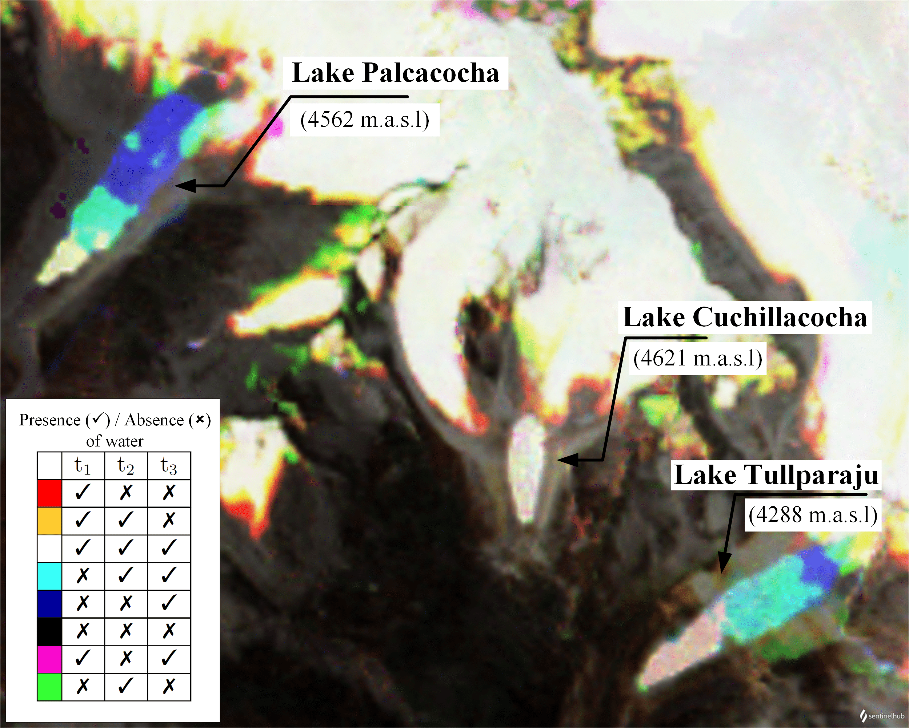

## Evaluate and visualize

- [EO Browser](https://sentinelshare.page.link/gJEu){:target="_blank"}   

## General description of the script

Lakes interact with all components of the hydrological system: atmospheric water, surface water, and groundwater. The fluxes of water to and from lakes with regard to each of these components represent the water budget of a lake [1]. The water level of a lake is a key response variable and an effective indicator of climate change. This response variable reflects either a direct influence of climate on the lake or an indirect change via the effect of climate on the catchment [2]. Measurements of water level are especially useful in the case of closed-basin lakes, where long-term fluctuations in water level can be related to similar fluctuations in large-scale climate oscillations [3].

In this context, I propose a script to assess spatial and temporal variations of the water level in lakes caused by climate change. For this purpose, the script is based on the Modified Normalized Difference Water Index (MNDWI) defined in [4] and uses Landsat 5 TM (Thematic Mapper) L2 images. In this particular case, the MNDWI is expressed as follows: 

**MNDWI = (B2 - B5) / (B2 + B5)**

In order to assess the spatio-temporal variation of the water level of the lake, the script detects the area covered by water using the MNDWI index in three differents images of the region on interest (ROI) temporarily separated (t1, t2 and t3). Then, to compose the output image, the script uses every color component (RGB) for each particular date.
Finally, the script will return a false color image where each pixel will be represented by a particular color related to the presence or absence of water for each date (t1, t2 and t3). 

## Applicability

In general, the script is applicable on lakes at global level. The most useful application of the script is its multitemporal feature, as it allows for analysis of spatial and temporaral variations of the lake water level. These variations could be related to climate change and drived by a set of the following climate-related drivers: precipitations, air temperature, wind speed, cloud cover and relative humidity [2]. The script is also applicable in regions of interest dominated by wetlands. In this case, the response of the MNDWI index allows mapping the spatio-temporal evolution of a wetland in a particular ROI and in a particular timespan period.

## Script limitations

The presence of clouds in one or more of the three input images will produce a failed assessment. For this reason it is recommended to use scenes with no cloud coverage over the specific ROI to be analysed (the lake) and with no or low presence of shadow areas. 

## Detailed script description

The script is divided into three parts: setup, scene selection and output.

**Setup**

This function is required as it sets up the input and output settings. The inputs of the script are the bands B2, B5 and dataMask of each image. With the values for each pixel of B2 and B5 the script will have the capability to calculate the MNDWI index. With the value of dataMask the script will have the capability of masks:
- All pixels which lay outside of the requested polygon (if specified).
- All pixels for which no source data was found.
- All pixels for which source data was found and is flagged as no-data.

The output of the script is configured to be an image of 4 bands: the three channels of color to compose the image (RGB) and a fourth band named alpha used to set the transparency for each pixel according to his data mask [7]. The mosaicking type is configured with the ORBIT parameter. This parameter defines how the source data is mosaicked, in this case the mosaicked image is flattened for each orbit [5].

In order to maximize the visual information in the output image, the user can set the minimum and maximum limits to stretch the histogram of the output image [5].

```javascript
var stretchMin = -0.6; 
var stretchMax = 1;
function setup() 
{
	return   {
		input: ["B02","B05","dataMask"],
		output: {bands: 4},
		mosaicking:"ORBIT"
	};
}	
```

**Scenes selection**

This part of the script is used to select the images acquired in three particular dates of interest (t1, t2 and t3) within the requested time range [5]. These dates must be configured by the user.

```javascript
function preProcessScenes (collections)
{
	var allowedDates = ["2003-08-20","2007-08-31","2011-09-27"];
	collections.scenes.orbits = collections.scenes.orbits.filter(function (orbit) 
	{
		var orbitDateFrom = orbit.dateFrom.split("T")[0];
		return allowedDates.includes(orbitDateFrom);
	})
	return collections
}	
```

**Output**

The evaluatePixel function maps the input bands in their input units to the values in the output raster. The function is executed once for each output pixel [5]. Inside of this function, the script calls to calcMNDWI function to calculate the value of the MNDWI index for each pixel and for each image. Then, a stretching function is applied to normalize the returned values. Additionally, in order to exclude the pixels where there is no data available for a particular image, in the return statement the script provides a conditional.

```javascript
function calcMNDWI(sample)
{
	MNDWI = index(sample.B02,sample.B05);
	return [MNDWI];
}
function stretch(val,min,max) 
{
	return (val-min)/(max-min);
}
function evaluatePixel(sample) 
{
	MNDWI_t1 = calcMNDWI(sample[2]); 
	MNDWI_t2 = calcMNDWI(sample[1]);
	MNDWI_t3 = calcMNDWI(sample[0]);
	
	MNDWI_t1 = stretch(MNDWI_t1,stretchMin,stretchMax);
	MNDWI_t2 = stretch(MNDWI_t2,stretchMin,stretchMax);
	MNDWI_t3 = stretch(MNDWI_t3,stretchMin,stretchMax);
	
	return [MNDWI_t1,MNDWI_t2,MNDWI_t3,sample[0].dataMask*sample[1].dataMask*sample[2].dataMask]; 
}	
```

Finally, the script will display the output image coded in a continous color scale.
The colors and their intermediate tones reflect the presence or absence of water for each particular pixel of the ROI analysed for the particular dates t1, t2 and t3.

## Description of representative images

Image of Mar Chiquita Lake (C—rdoba, Argentina) between 2003 and 2011. In this timespan the lake underwent a considerable water level decrease. Notice in red, yellow and white the decrease of water levels at each particular date (t1, t2 and t3).



Image of Mar Chiquita Lake (C—rdoba, Argentina) between 1990 and 1996. In this timespan, initially the water level increased (between t1 and t2), then decreased (between t2 and t3). This difference is displayed in green color.



Output image for dates between 2003 and 2011. In this timespan, Mar Chiquita Lake (C—rdoba, Argentina) underwent a water level decrease. Notice the changes in water level diplayed in red, yellow and green between the three dates (t1, t2 and t3).



Output image for dates between 1990 and 1996. In this timespan, initially Mar Chiquita Lake (C—rdoba, Argentina) water level increased (between t1 and t2) and then decreased (t2 and t3). Notice the green area corresponding to this behaviour.


Image of Quillcay catchment (Cordillera Blanca, Peru) between 1990 and 2010. Notice the spatio-temporal variation of the water level of Palcacocha, Cuchillacocha and Tullparaju Lakes, according to the differents colors.



## Author of the script

- Fernando Rodr’guez Brizuela

## References

- [1] Winter, T.C., Hydrological processes and the water budget of lakes., 1995. Physics and Chemistry of Lakes (Eds A. Lerman, D.M. Imboden and J.R. Gat), Springer-Verlag, Heidelberg. 2nd edn, pp.37-82.
- [2] Adrian, R., O'Reilly, C.M., Zagarese, H., Baines, S.B., Hessen, D.O., Keller, W., Living-stone,
D.M., Sommaruga, R., Straile, D., van Donk, E., Weyhenmeyer, G.A., Winder,M., Lakes as sen-
tinels of climate change, Limnol. Oceanogr., 2009. 54, 2283-2297.
- [3] Rodionov, S. N., Global and regional climate interaction: The Caspian Sea experience, 1994. Springer
- [4] Xu, H., Modification of normalised diference water index (NDWI) to enhance open water features in remotely sensed imagery, 2006. International Journal of Remote Sensing 27.14, 3025-3033
- [5] Sentinel Hub User Guide Evalscript V3, https://docs.sentinel-hub.com/api/latest/evalscript/v3/
- [6] Sentinel Hub User Guide Datamasks, https://docs.sentinel-hub.com/api/latest/user-guides/datamask/
- [7] Sentinel Hub User Guide Transparency, https://docs.sentinel-hub.com/api/latest/user-guides/transparency/
- [8] Bucher E.H., Curto E., Infuence of long-term climatic changes on breeding of the Chilean flamingo in Mar Chiquita, Cordoba, Argentina, Springer. 697, 127-137
- [9] Troin, M., Vallet-Coulomb C., Sylvestre F., Piovano E.Hydrological modelling of a closed lake (Laguna Mar Chiquita, Argentina) in the context of 20th century climatic changes, 2010. Journal of Hydrology. 393, 233-244
- [10] Bucher, E.H., Stein A.Large Salt Dust Storms Follow a 30-Year Rainfall Cycle in the Mar Chiquita Lake (Cordoba, Argentina), 2016. PLoS ONE 11(6): e0156672. doi:10.1371/journal.pone.0156672
- [11] Frey H., Huggel C., Chisolm R.E., Baer P.,McArdell B., Cochachin A. and Portocarrero C. Multi-Source Glacial Lake Outburst Flood Hazard Assessment and Mapping for Huaraz, Cordillera Blanca, Peru, 2018. Front. Earth Sci. 6,210. doi: 10.3389/feart.2018.00210
- [12] D. S. Rivas, M. A. Somos-Valenzuela, B. R. Hodges, and D. C. McKinney Predicting outflow induced by moraine failure in glacial lakes: the Lake Palcacocha case from an uncertainty perspective, 2015. Nat. Hazards Earth Syst. Sci., 15, 1163-1179
 
