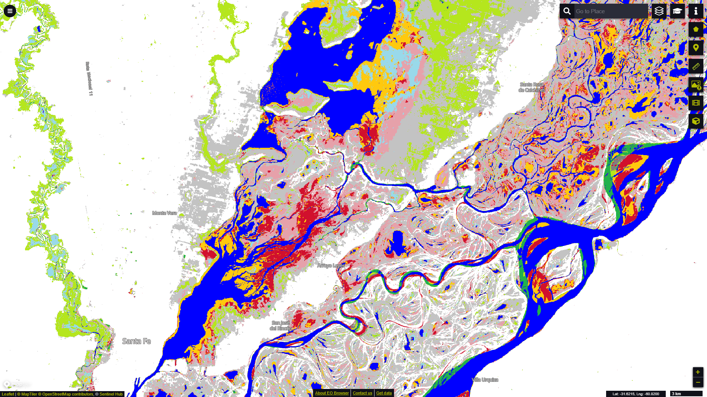

# Global Surface Water Transitions visualisation script

<a href="#" id='togglescript'>Show</a> script or [download](script.js){:target="_blank"} it.





## General description of the script

This script visualizes the Transitions layer from the Global Surface Water dataset according to the official symbology (Table 1). The Transitions layer is derived from a seasonality comparison between the first and last year of the entire time period and visualises changes in the three surface water classes of not water, seasonal, and permanent water.

Table 1: Transitions Symbology

<table>
  <thead>
    <tr>
      <th>Value</th>
      <th>Symbol</th>
      <th>Colour</th>
      <th>Label</th>
    </tr>
  </thead>
  <tbody>
    <tr>
      <td>0</td>
      <td style="background-color:#FFFFFF"></td>
      <td>0xffffff</td>
      <td>Not water</td>
    </tr>
    <tr>
      <td>1</td>
      <td style="background-color:#0000FF"></td>
      <td>0x0000ff</td>
      <td>Permanent</td>
    </tr>
    <tr>
      <td>2</td>
      <td style="background-color:#22B14C"></td>
      <td>0x22b14c</td>
      <td>New permanent</td>
    </tr>
    <tr>
      <td>3</td>
      <td style="background-color:#D1102D"></td>
      <td>0xd1102d</td>
      <td>Lost permanent</td>
    </tr>
    <tr>
      <td>4</td>
      <td style="background-color:#99D9EA"></td>
      <td>0x99d9ea</td>
      <td>Seasonal</td>
    </tr>
    <tr>
      <td>5</td>
      <td style="background-color:#B5E61D"></td>
      <td>0xb5e61d</td>
      <td>New seasonal</td>
    </tr>
    <tr>
      <td>6</td>
      <td style="background-color:#E6A1AA"></td>
      <td>0xe6a1aa</td>
      <td>Lost seasonal</td>
    </tr>
    <tr>
      <td>7</td>
      <td style="background-color:#FF7F27"></td>
      <td>0xff7f27</td>
      <td>Seasonal to permanent</td>
    </tr>
    <tr>
      <td>8</td>
      <td style="background-color:#FFC90E"></td>
      <td>0xffc90e</td>
      <td>Permanent to seasonal</td>
    </tr>
    <tr>
      <td>9</td>
      <td style="background-color:#7F7F7F"></td>
      <td>0x7f7f7f</td>
      <td>Ephemeral permanent</td>
    </tr>
    <tr>
      <td>10</td>
      <td style="background-color:#C3C3C3"></td>
      <td>0xc3c3c3</td>
      <td>Ephemeral seasonal</td>
    </tr>
    <tr>
      <td>255</td>
      <td style="background-color:#CCCCCC"></td>
      <td>0xcccccc</td>
      <td>No data</td>
    </tr>
  </tbody>
</table>
 

## Description of representative images

*EO Browser visualisation of the Transitions layer showing the Paraná River near santa Fe, Argentina.*

## Resources

- [Data Source](https://global-surface-water.appspot.com/download)

- [Entry in public collections](https://collections.sentinel-hub.com/global-surface-water/)

- [Entry in public collections repository](https://github.com/sentinel-hub/public-collections/tree/main/collections/global-surface-water)
