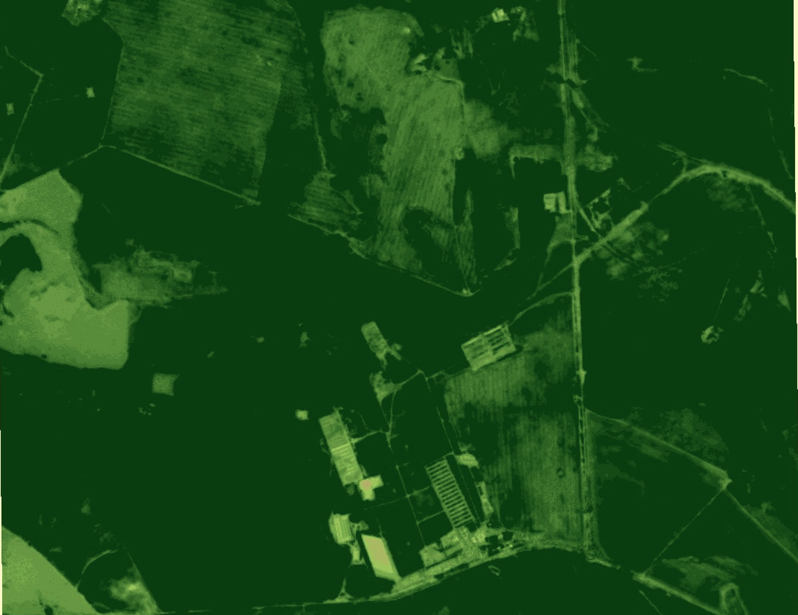

## General description

The script evaluates the NDVI for each scene of the past month and returns the highest NDVI value for every pixel. In short, it returns the highest NDVI values of the past month for every pixel. The script runs on-the-fly, since
it doesn't require preprocessing. It can be used as a cloud free background or an input for further analysis, such as change detection and classification. [Find out more.](https://www.sentinel-hub.com/max_service){:target="_blank"}  
Note that multi-temporal processing needs to be enabled for this script to run.

## Author of the script

William Ray

## Description of representative images

