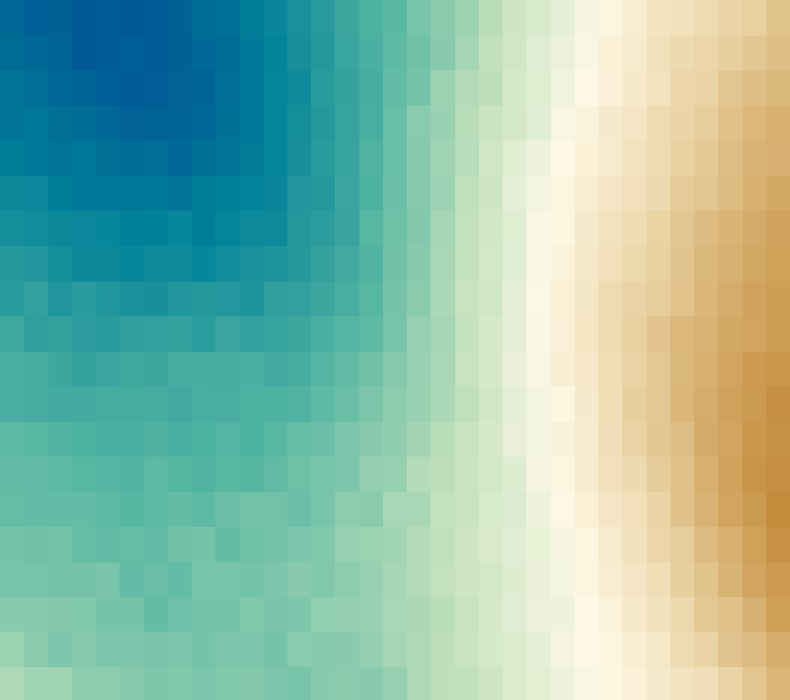
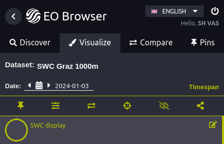
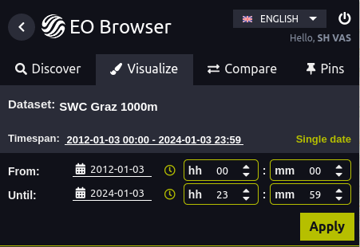

## Description of representative images

The visualization represents negative soil water content anomalies (less water content than on average) in shades of red and positive soil water content anomalies (more water content than on average) in hues of blue.

Soil Water Content Anomaly (C band 1000 m) on June 3rd, 2023 Graz, Austria.

| True Color Image of AOI (June 9th) |      Soil Water Content (SWC)      |              Standardized Anomaly of SWC               |
| :--------------------------------: | :--------------------------------: | :----------------------------------------------------: |
|   |  |  |

## General description

This script calculates the standardized anomaly of the soil water content for a particular date. It takes all values of the same day of the year in previous years and calculates the mean and standard deviation of the value. The anomaly is then defined as the current value subtracted by the mean of the reference period. To get the _standardized_ anomaly, the absolute anomaly value is then divided by the standard deviation of the reference period.

The standardized anomaly can be compared between different areas and different sensors and is the one produced by this script. If the absolute anomaly is desired the last step in the evalscript of dividing by the standard deviation can be removed. This then results in anomalies in the unit of measurement. In this case $$m^3/m^3$$ below or above the mean water content during the reference period.

## Notes on usage

### EO Browser

To use this script in the EO Browser, a time span needs to be set in the interface. To do this, visualize the date you want to calculate an anomaly for. Then in the Visualize panel, hit the green `Timespan` button.

In the interface which then appears, select the time range you want to use as reference period. In this case, we select a time range from 2012 to 2024, which is 12 years. Be aware that this will only include data which is available, so if you ordered data for 5 years but specify a time range of 10 years, only the 5 years you have ordered will be included.

_Please note_: The date that is compared to the reference period is always the most recent date with data in the selected time span.

### Reference Period

The reference period represents which dates get included for each year and is determined by the variable `toleranceDays` in the evalscript. This variable determines how many days adjacent to the selected day are included in the calculation. If the day for which an anomaly is computed is the 10th of January 2024 and `toleranceDays` is 0, only data in previous years that are also exactly on the 10th of January will be considered. If `toleranceDays` is 1, for each year in the reference period, one day before and after the 10th of January will also be considered and included in the calculation.

### Visualization

In the visualization script you can modify the color scale by changing the variables `vmin` and `vmax`. Those are the maximum and minimum values of the color ramp. If the anomaly is only very slight, you might want to change `vmin` and `vmax` to lower values to be able to see slight differences better.

## References

-   [Product specifications](https://planet.widen.net/s/5xtzljjwgg)
-   [Data sheet](https://planet.widen.net/s/cv7bfjhhd5)
-   [Sentinel Hub documentation about Soil Water Content](https://docs.sentinel-hub.com/api/latest/data/planetary-variables/soil-water-content/)
