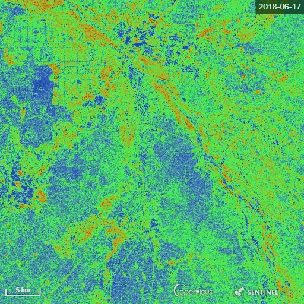

## General description of the script

The goal of the script is to calculate the Radar Vegetation Index for Sentinel-1 (RVI4S1) like dual-pol SAR data. In this script, we utilize Sentinel-1 GRD products as input and calculate the RVI4S1 index for monitoring crop growth. The theoretical value of this index ranges from 0 to 1. The bare soil or pure elementary targets indicate a very low RVI4S1 index towards zero. Conversely, a fully developed crop canopy advance the index towards 1. Zero is indicated by pink, whereas green indicates RVI4S1 == 1.0.

## Details of the script

The script is applicable to monitor crop condition over the global scale and invariant to crop types. The vegetation indices developed here utilize the GRD product. First, an equivalent to the degree of polarization (DOP) is calculated as VV/SPAN. SPAN is total power received at both the channel and can be treated as VV+VH. The DOP is utilized to obtain the depolarized fraction as m = 1 - DOP. The m factor ranges between 0 and 1. For pure or elementary targets the m value is close to zero; whereas for fully random canopy (at high vegetative growth), it reaches close to 1. This m factor is multiplied with the vegetation depolarization power fraction (4xVH)/(VV+VH). The m factor is modulated with a square root scaling for a better dynamic range of the RVI4S1 index. The index also separates urban areas and bare soil from the vegetated terrain. However, for very rough soil (likely after tillage) or water surface (high windy condition), the DOP would be lower, which turns the RVI4S1 to be quite higher than a smooth surface. Hence care should be taken with this particular condition.

## Author of the script

Dipankar Mandal

## Description of representative images

1) Manitoba province, Canada

The representative image of RVI4S1 generated by EO Browser custom script. It shows the start of the season (11 May) to high vegetative growth condition (22 July) of summer 2019 in Manitoba province, Canada. This region is dominating by cereal crops (wheat, oats, barley), corn, canola and soybean. Throughout the growth season changes in RVI4S1 values are observed. The index changes from almost 0 to close to 1 as crop advanced.

2) Andhra Pradesh, India

The representative image of RVI4S1 generated by EO Browser custom script. It shows the start of the season (17 June) to high vegetative growth condition (08 November) of monsoon 2018 in Andhra Pradesh, India. This region is dominating by rice. Throughout the growth season changes in RVI4S1 values are observed. The index changes from almost 0 to close to 1 as crop advanced.

