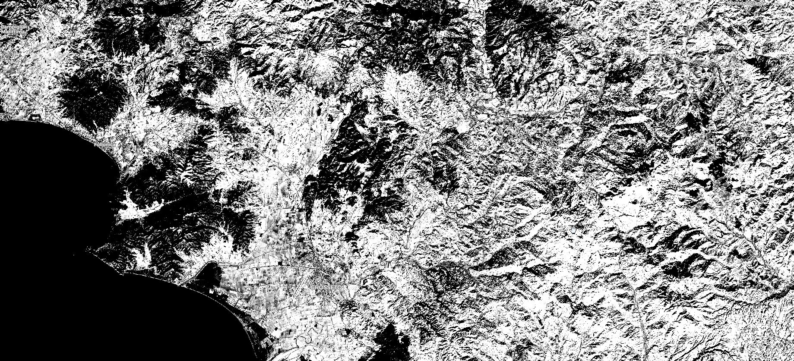

# ARI - Anthocyanin Reflectance Index


<button class="btn btn-primary" id="toggle-script" onclick="toggleScript()">Show Script</button>
[Download Script](script.js){: .btn target="_blank" download="{{paths | append: ".js"}}"}
{: .mt-lg-4 }

 




## Evaluate and visualize
 - [Sentinel Playground](https://apps.sentinel-hub.com/sentinel-playground/?source=S2&lat=41.956171100940026&lng=12.29095458984375&zoom=11&preset=CUSTOM&layers=B01,B02,B03&maxcc=5&gain=1.0&gamma=1.0&time=2018-05-01%7C2018-11-14&atmFilter=&showDates=false&evalscript=Ly8KLy8gQW50aG9jeWFuaW4gcmVmbGVjdGFuY2UgaW5kZXggIChhYmJydi4gQVJJKQovLwovLyBHZW5lcmFsIGZvcm11bGE6IDEvNTUwbm0tMS83MDBubQovLwovLyBVUkwgaHR0cHM6Ly93d3cuaW5kZXhkYXRhYmFzZS5kZS9kYi9zaS1zaW5nbGUucGhwP3NlbnNvcl9pZD05NiZyc2luZGV4X2lkPTIxNAoKbGV0IGluZGV4ID0gMS4wIC8gQjAzIC0gMS4wIC8gQjA1OwpyZXR1cm4gW2luZGV4XQ%3D%3D){:target="_blank"}    
 - [EO Browser](https://apps.sentinel-hub.com/eo-browser/?lat=42.4979&lng=11.6345&zoom=10&time=2019-12-10&preset=CUSTOM&datasource=Sentinel-2%20L1C&layers=B01,B02,B03&evalscript=Ly8KLy8gQW50aG9jeWFuaW4gcmVmbGVjdGFuY2UgaW5kZXggIChhYmJydi4gQVJJKQovLwovLyBHZW5lcmFsIGZvcm11bGE6IDEvNTUwbm0tMS83MDBubQovLwovLyBVUkwgaHR0cHM6Ly93d3cuaW5kZXhkYXRhYmFzZS5kZS9kYi9zaS1zaW5nbGUucGhwP3NlbnNvcl9pZD05NiZyc2luZGV4X2lkPTIxNAoKbGV0IGluZGV4ID0gMS4wIC8gQjAzIC0gMS4wIC8gQjA1OwpyZXR1cm4gW2luZGV4XQ%3D%3D){:target="_blank"}

## General description of the script

Anthocyanins are pigments common in higher plants, causing their red, blue and purple coloration. They provide valuable information about the physiological status of plants, as they are considered indicators of various types of plant stresses.

The reflectance of anthocyanin is highest around 550nm. However, the same wavelengths are reflected by chlorophyll as well. To isolate the anthocyanins, the 700nm spectral band, that reflects only chlorophyll and not anthocyanins, is subtracted. 

ARI looks like this:

**ARI1 = (1 / 550nm) - (1 / 700nm)** 

For Sentinel-2, the index would be calculated using the green spectral band (B03) and a red edge spectral band (B05) as follows: 

**ARI1 = (1 / B03) - (1 / B05)**

ARI values for the examined trees in this original article ranged in values from 0 to 0.2. 

## Description of representative images

ARI applied to Rome. Acquired on 10.12.2019, processed by Sentinel Hub. 

## References
- [Non-Destructive Estimation of Anthocyanins and Chlorophylls in Anthocyanic Leaves (Gitelson, Chivkunova, Merzlyak)](http://digitalcommons.unl.edu/cgi/viewcontent.cgi?article=1227&context=natrespapers){:target="_blank"}
- [Vegetation Analysis: Using Vegetation Indices in ENVI](https://www.harrisgeospatial.com/Support/Self-Help-Tools/Help-Articles/Help-Articles-Detail/ArtMID/10220/ArticleID/16162/Vegetation-Analysis-Using-Vegetation-Indices-in-ENVI){:target="_blank"}
