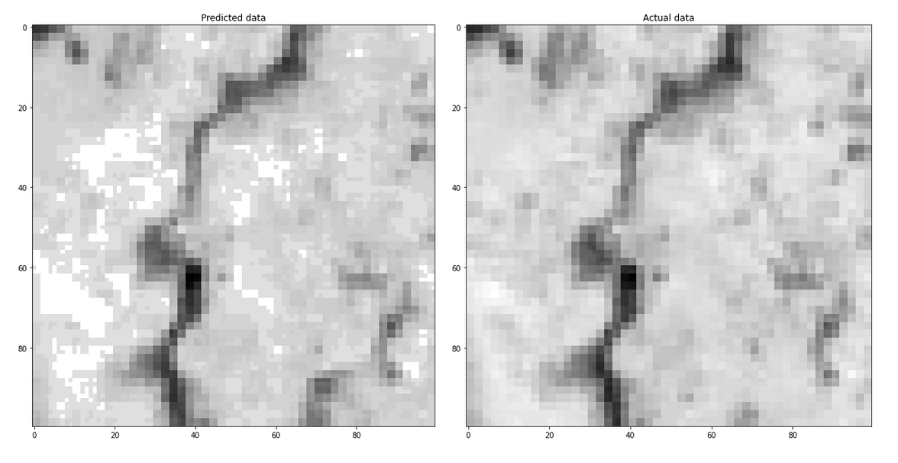

# Deep BAIS2 Script

<a href="#" id='togglescript'>Show</a> script or [download](script.js){:target="_blank"} it.





## Evaluate and visualize   
 - [EO Browser](https://apps.sentinel-hub.com/eo-browser/?zoom=9&lat=50.76339&lng=3.01712&themeId=DEFAULT-THEME&datasetId=S2L2A&fromTime=2020-02-25T00%3A00%3A00.000Z&toTime=2020-02-25T23%3A59%3A59.999Z&visualizationUrl=https%3A%2F%2Fservices.sentinel-hub.com%2Fogc%2Fwms%2Fbd86bcc0-f318-402b-a145-015f85b9427e&evalscripturl=https%3A%2F%2Fraw.githubusercontent.com%2Froshni-b%2Feolearn-scripts%2Fmain%2FBAI_LGBMr_eval.js#custom-script){:target="_blank"} 

## General description of the script

The raw data for Burned Area Index for Sentinel 2 (BAIS2) has been extracted using a [custom script](https://custom-scripts.sentinel-hub.com/sentinel-2/bais2/) via Sentinel Hub's Feature Info Service (FIS). It performs elementary statistical computations - such as mean, standard deviation, etc. approximating the distribution of reflectance values - on remotely sensed data for a region specified in a given spatial reference system across different bands and time ranges. 

The next subsections describe the different stages of the methodology for data handling, performing the prediction and visualizing the prediction results.

- The region chosen for training the model in this notebook is Empedrado, Chile.
- From the bounding box coordinated for Emperdrado, the region in the GeoJSON split into smaller tiles from which a 5x5 grid is selected.
- The EOPatches are filled with BAI data from Sentinel Hub having minimal cloud coverage.

EOPatches are created and manipulated using EOTasks, which are then chained in an EOWorkflow. The following workflow is created and executed:

- Create EOPatches with band and cloud data.
- Add mask of valid pixels.
- Calculate and add BAI data.
- Save EOPatches

Once all the EOpatches are extracted, we visualize the following:

- True colour image.
- BAIS2 data with the VALID_DATA mask.
- Mean BAIS2 data of all days.
- Mean BAIS2 data over a single eopatch.

The obtained data is pre-processed and prepared for training for which we create a new workflow that performs the following preprocessing:

- Checks the ratio of the valid data for each EOPatch and for each time frame
- Retain only time frames with > 80% valid coverage

The complete data array is split to train and test sets in the ratio 0.7 Additional variables Normalized Difference Vegetation Index (NDVI), Normalized Difference Water Index  (NDWI), Normalized Difference Built up Index (NDBI) are also used as features during the training process.

- NDVI: (B08 - B04)/(B08 + B04)
- NDWI: (B03 - B08)/(B03 + B08)
- NDBI: (B11 - B08)/(B11 + B08)

The data is fit on a [LightGBMRegressor()](https://lightgbm.readthedocs.io/en/latest/pythonapi/lightgbm.LGBMRegressor.html).

## Details of the script

Burnt Area Index for Sentinel 2 (BAIS2) is the index that highlights burned land in the red to near-infrared spectrum, by emphasizing the charcoal signal in post-fire images. The index is computed from the spectral distance from each pixel to a reference spectral point, where recently burned areas converge. Brighter pixels indicate burned areas.

A Burned Area Prediction Regression model has been developed in the form of a custom script for the Sentinel Hub EOBrowser, using Sentinel-2 MSI reflectance measurements in the short and near infrared wavebands as inputs.

### Intents & Motivations

Change detection from multi-temporal remote sensing images is an effective way to identify the burned areas during and after wildfires. With the recent development of more improved models for the detection and prediction of Burned Area Index for Sentinel 2 (BAIS2), the severity of the wildfire can be anticipated so that adequate measures can be taken. This machine learning model can be deployed in a custom script format and visualised in Sentinel Hubís EOBrowser tool.

### False Detection Problems (If Any)

The complex image scenario and the similar spectral signatures in multispectral bands may lead to many false positive errors, which make it difficult to exact the burned areas accurately.

More details are available in the [supplementary material](supplementary_material.pdf){:target="_blank"}.

## Authors of the script

Roshni Biswas, Anurag Saha Roy

## Description of representative images

The Burn Area Index for Sentinel 2 (BAIS2) uses the reflectance values in the red and NIR portion of the spectrum to identify the areas of the terrain affected by fire.

BAI = 1/((0.1 -RED)^2 + (0.06 - NIR)^2)

- Red = pixel values from the red band
- NIR = pixel values from the near infrared band

The images here are in grayscale. They represent predicted vs actual data.

## References

[1] Chuvieco, E., M. Pilar Martin, and A. Palacios. "[Assessment of Different Spectral Indices in the Red-Near-Infrared Spectral Domain for Burned Land Discrimination.](https://www.tandfonline.com/doi/abs/10.1080/01431160210153129)" Remote Sensing of Environment 112 (2002): 2381-2396." (ESRI, 2018)