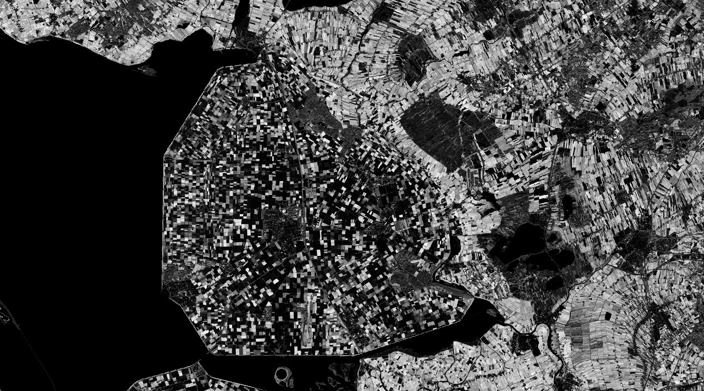

# FCOVER (Fraction of green Vegetation Cover)

<a href="#" id='togglescript'>Show</a> script or [download](script.js){:target="_blank"} it.





## Evaluate and visualize
 - [Sentinel Playground](https://apps.sentinel-hub.com/sentinel-playground/?source=S2&lat=43.514198796857976&lng=16.601028442382812&zoom=11&evalscripturl=https://raw.githubusercontent.com/sentinel-hub/custom-scripts/master/sentinel-2/fcover/script.js){:target="_blank"}    
 - [EO Browser](http://apps.sentinel-hub.com/eo-browser/#lat=41.9&lng=12.5&zoom=10&datasource=Sentinel-2%20L1C&time=2017-10-08&preset=CUSTOM&layers=B01,B02,B03&evalscripturl=https://raw.githubusercontent.com/sentinel-hub/custom-scripts/master/sentinel-2/fcover/script.js){:target="_blank"}   
 When EO Browser loads, switch to **code view**, then check the **Use URL** checkbox and press **Refresh**.

## General description of the script

The Fraction of Vegetation Cover (FCover) corresponds to the fraction of ground covered by green vegetation. Practically, it quantifies the spatial extent of the vegetation. Because it is independent from the illumination direction and it is sensitive to the vegetation amount, FCover is a very good candidate for the replacement of classical vegetation indices for the monitoring of ecosystems.

Note that the FCOVER script is as implemented in SNAP but without input and output validation!
Input/output values which are suspect are not reported or changed. Most values, however, do not fall under this category.
Visualized as an interval from 0-1. This can be adjusted in the evaluatePixel method.

## Description of representative images

FCOVER visualization of Emmeloord, Flevoland, The Netherlands. Acquired on 18.11.2020.

## References
- [COPERNICUS Global Land Service](https://land.copernicus.eu/global/products/fcover)
- [S2Toolbox Level 2 products ATBD](https://step.esa.int/docs/extra/ATBD_S2ToolBox_L2B_V1.1.pdf)
