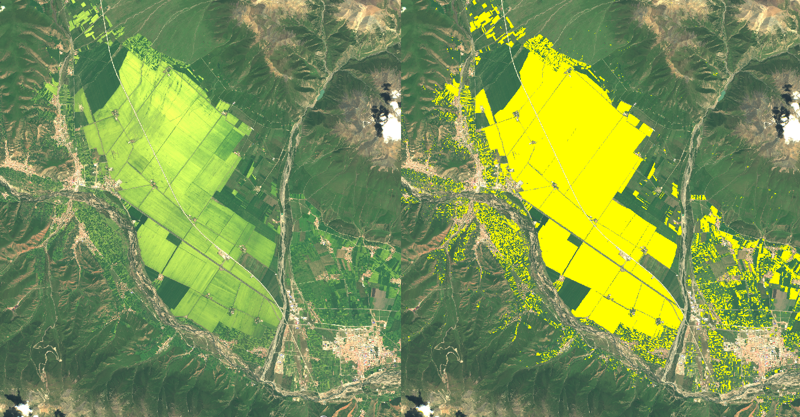

# Normalized Difference Yellowness Index (NDYI), visualisation of blooming in an Amazonian tree species and canola crops

<a href="#" id='togglescript'>Show</a> script or [download](barren_soil_script.js){:target="_blank"} it.





## Evaluate and visualize
 - [EO Browser](https://sentinelshare.page.link/dvmB){:target="_blank"} 

## General description of the script

_Schizolobium parahyba_ is a species that is distributed in a large part of the Bolivian and South American Amazon. The flowering of this species is annual and coincides with the arrival of the boreal winter, dry season or time of less precipitation, between the months of May and July. Schizolobium parahyba is deciduous, can reach 40 metres in height, is heliophytic and has a large crown. It develops inflorescences with yellow petalled flowers which can be very prominent at flowering time, so much so that individual trees of the species can be detected in the visible spectrum with remote sensors like Sentinel-2. The flowering season of Schizolobium parahyba is closely associated with climate variations, therefore an alteration of its phenological cycle can be considered as an indicator of climate change [1].

The index (NDYI) was originally developed and applied to detect the flowering of canola crops as an alternative to the traditional indices used to measure the productivity of these crops, taking advantage of the high reflectivity in the blue and green bands of the yellow petals of their flowers [2]. This index was also used for mapping and tracing the changes in canola planting areas and yields in China from MODIS medium resolution sensor data [3]. 

To execute this script, Sentinel-2 L1C (Top-of-atmosphere reflectances) satellite images were used to find the ratio between blue and green band reflectances by means of the normalized difference yellowness index (NDYI), in order to discriminate and visualize more easily the flowering of individuals and populations of Schizolobium parahyba and canola crops and to relate their phenological cycles to climate change.

**Applicability of the script**

This script was applied for the discrimination and visualisation of the flowering of the species Schizolobium parahyba in the region of the Noel Kempff Mercado National Park in the department of Santa Cruz, Bolivia, and was also used in large canola crops regions during the flowering season in Canada and China. There is also the possibility of applying this script to the visualisation and discrimination of the flowering of other plant species in natural environments, as well as in other canola growing regions around the world.

**False detection problems and limitations**

- There are limitations in terms of sensitivity due to the resolution and the mixture of pixels. 
- In some cases it is not possible to discriminate in early or late flowering stages of the Schizolobium parahyba species and canola crops
- The ranges of NDYI values chosen as thresholds for the discrimination of flowering trees and the environment sometimes incorporate savannah vegetation and in other cases do not incorporate flowering trees that are in the process of greening
- In some cases bare soil, unvegetated crop fields and roads are not discriminated.

**How the script works**

The script uses the Sentinel-2 blue and green bands (B02 and B03) as input data to calculate the normalised difference yellowness index (NDYI) with formula **NDYI = ((B03 - B02) / (B03 + B02))**. To discriminate and visualise the objects of interest, it was necessary to adjust the conditional NDVI value, empirically NDYI < 0.02 - 0.08 for in bloom trees, while for flowering canola crops NDYI < 0.08 - 0.13 showed to be adequate.

## Description of representative images

**Example 1**

In the example below, the upper image shows the true colour composition of Huanchaca plateau and evergreen forest, in the Noel Kempff Mercado National Park, located in the northeast of the department of Santa Cruz, Bolivia. The trees in bloom are most likely of the species Schizolobium parahyba. The bottom image shows the result of the application of the script in solid yellow, highlighting the crowns of the individual trees. Image acquired on June 16, 2022.

**Example 2**

The upper image of the below example shows a true colour composite of an area near El Porvenir in the Velasco Province of the department of Santa Cruz, Bolivia. It shows populations of Schizolobium parahyba in bloom (locally known as Serebo). The bottom image shows the result of the application of the script in solid yellow. Image acquired on June 16, 2022.

**Example 3**

On the example below, the left image shows a true colour composite of an area in Haibei prefecture, one of the largest canola-producing regions in northern China [3]. The right image shows the classification of flowering canola crops, presented in solid yellow. Image acqired on September 12, 2017.

**Example 4**

On this example, the top image shows a true colour composite of an agricultural area in the province of Alberta, Canada. The bottom image shows the classification of flowering canola crops, presented in solid yellow. Image acquired on June 29, 2021

## Author of the script

- Mario Alberto Guzmán Soza

## Credits

The formula for finding the normalized difference yellowness index (NDYI) was taken from the reference [2].

## References

- [1] Justiniano, M. J., Pariona, W., Fredericksen, T. S., & Nash, D. (2001). Ecología y silvicultura de especies menos conocidas: Serebó o Sombrerillo Schizolobium parahyba (Vell.) SF Blake Caesalpiniaceae (No. 634.973749 E19). Proyecto de Manejo Forestal Sostenible, Santa Cruz (Bolivia).
- [2] Sulik, J. J. & Long, D. S. (2016). Spectral considerations for modeling yield of canola. Remote Sensing of Environment, 184, 161–174. doi:10.1016/j.rse.2016.06.016
- [3] Zang, Y., Chen, X., Chen, J., Tian, Y., Shi, Y., Cao, X., Cui, X. (2020). Remote Sensing Index for Mapping Canola Flowers Using MODIS Data. Remote Sens. 12, 3912. doi:10.3390/rs12233912
