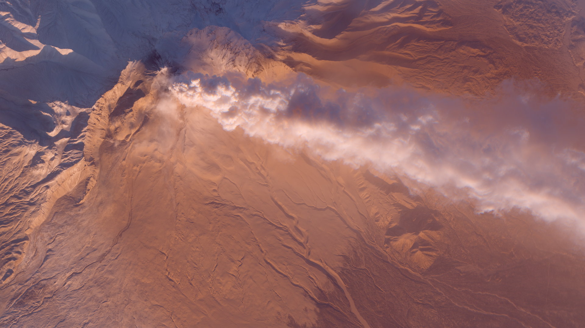
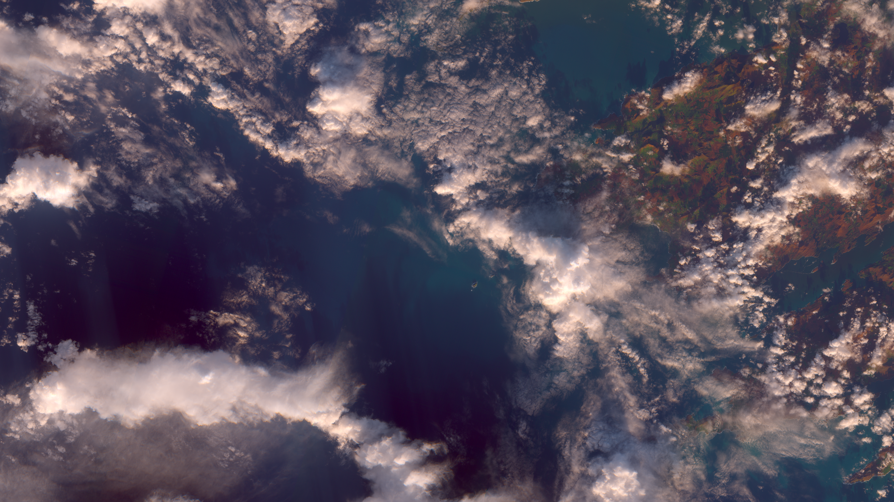

## Evaluate and visualize   
 - [EO Browser](https://apps.sentinel-hub.com/eo-browser/?lat=41.4875&lng=15.9494&zoom=11&time=2019-12-14&preset=CUSTOM&datasource=Sentinel-2%20L1C&layers=B01,B02,B03&evalscript=dmFyIHRvbmVtYXBNZXRob2QgPSA0OwovLyAwIC0gU2ltcGxlIFJlaW5oYXJkCi8vIDEgLSBMdW1hIGJhc2VkIFJlaW5oYXJkCi8vIDIgLSBVbmNoYXJ0ZWQgMiBmaWxtaWMgY3VydmUKLy8gMyAtIEFDRVMgUmVpbmhhcmQKLy8gNCAtIEFDRVMgVW5jaGFydGVkCgp2YXIgZGVidWcgPSBmYWxzZTsKCnZhciBhZGpGb3JTdW5Db2xvciA9IHRydWU7Cgp2YXIgYXRtb3NwaGVyZSA9IDAuMDIzOwoKdmFyIGdhaW4gPSAxLjU7Cgp2YXIgc2F0dXJhdGlvbiA9IDIuMDsKCnZhciBXaGl0ZSA9IDMuMDsKCi8vIGF0bW9zcGhlcmljIGFkanVzdG1lbnQKLy9odHRwczovL2N1c3RvbS1zY3JpcHRzLnNlbnRpbmVsLWh1Yi5jb20vc2VudGluZWwtMi9wb29yX21hbnNfYXRjb3IvIwp2YXIgYzByID0gYXRtb3NwaGVyZTsKCnZhciBhdG1SYXRpb3MgPSBbMSwgMiwgMy4yNV07IC8vIFJheWxlaWdoLWRlcml2ZWQgY29uc3RzIGZvciBhdXRvbWF0ZWQgYXRtb3NwaGVyZSBvZmZzZXRzCgp2YXIgYXRtMnAgPSAoYSwgYzAsIGMxKSA9PiAoYSAtIGMwKSAvIGMxOwoKdmFyIGF0bTFwID0gKGEsIGMwKSA9PiBhdG0ycChhLCBjMCwgKDEgLSBjMCkqKjIpOwoKdmFyIGF0bSA9IChhLCBpaSkgPT4gKHR5cGVvZiBjTWFudWFsICE9PSAndW5kZWZpbmVkJykKICAgID8gKGNNYW51YWxbaWldIGluc3RhbmNlb2YgQXJyYXkpCiAgICAgICAgPyBhdG0ycChhLCBjTWFudWFsW2lpXVswXSwgY01hbnVhbFtpaV1bMV0pCiAgICAgICAgOiBhdG0xcChhLCBjTWFudWFsW2lpXSkKICA6IGF0bTFwKGEsIGMwciAqIGF0bVJhdGlvc1tpaV0pOwoKZnVuY3Rpb24gbWF0TXVsKHZlYywgbWF0KQp7CiAgcmV0dXJuICAgW3ZlY1swXSAqIG1hdFswXVswXQogICAgICAgICAgICt2ZWNbMV0gKiBtYXRbMF1bMV0KICAJCSAgICt2ZWNbMl0gKiBtYXRbMF1bMl0sCiAgICAgICAgICAgIHZlY1swXSAqIG1hdFsxXVswXQogICAgICAgICAgICt2ZWNbMV0gKiBtYXRbMV1bMV0KICAJCSAgICt2ZWNbMl0gKiBtYXRbMV1bMl0sCiAgICAgICAgICAgIHZlY1swXSAqIG1hdFsyXVswXQogICAgICAgICAgICt2ZWNbMV0gKiBtYXRbMl1bMV0KICAJCSAgICt2ZWNbMl0gKiBtYXRbMl1bMl0gICAgICAgICAKICAgICAgICAgICBdOwp9Cgpjb25zdCBSR0JMaW5fMl9BUDAgPSBbCiAgICBbMC40Mzk3MDEwLCAwLjM4Mjk3ODAsIDAuMTc3MzM1MF0sCiAgICBbMC4wODk3OTIzLCAwLjgxMzQyMzAsIDAuMDk2NzYxNl0sCiAgICBbMC4wMTc1NDQwLCAwLjExMTU0NDAsIDAuODcwNzA0MF1dOwoKY29uc3QgQVAwXzJfUkdCTGluID0gWwogICAgWzIuNTIxNjksIC0xLjEzNDEzLCAtMC4zODc1Nl0sCiAgICBbLTAuMjc2NDgsIDEuMzcyNzIsIC0wLjA5NjI0XSwKICAgIFstMC4wMTUzOCwgLTAuMTUyOTgsIDEuMTY4MzVdXTsKCgovLy8vLy8vLy8vLy8vLy8vLy8vLy8vLy8vLy8vLy8vLy8vLy8vLy8vLwovLy8gICAgVGhlIGludGVyZXN0aW5nIHBhcnQ6Ci8vLy8vLy8vLy8vLy8vLy8vLy8vLy8vLy8vLy8vLy8vLy8vLy8vLy8vCmZ1bmN0aW9uIEdldEx1bWEocmdiKQp7CgkvLyBodHRwczovL2VuLndpa2lwZWRpYS5vcmcvd2lraS9SZWxhdGl2ZV9sdW1pbmFuY2UKICAJcmV0dXJuIHJnYlswXSAqIDAuMjEyNiArIHJnYlsxXSAqIDAuNzE1MiArIHJnYlsyXSAqIDAuMDcyMgp9CgoKZnVuY3Rpb24gU2F0dXJhdGUocmdiKSB7CiAgdmFyIEwgPSBHZXRMdW1hKHJnYik7CiAgcmdiID0gcmdiLm1hcChhID0%2BIE1hdGgubWF4KCBMICsgKGEgLSBMKSAqIHNhdHVyYXRpb24sMC4pKTsKICByZXR1cm4gcmdiOwp9CgpmdW5jdGlvbiBVbmNoYXJ0ZWQyRmlsbWljQ3VydmUoeCkKewogIC8vIFVuY2hhcmVkMiB0b25lIG1hcHBpbmcgKFNlZSBodHRwOi8vZmlsbWljZ2FtZXMuY29tKQogIGNvbnN0IEEgPSAwLjE1OwogIGNvbnN0IEIgPSAwLjUwOwogIGNvbnN0IEMgPSAwLjEwOwogIGNvbnN0IEQgPSAwLjIwOwogIGNvbnN0IEUgPSAwLjAyOwogIGNvbnN0IEYgPSAwLjMwOwogIGNvbnN0IFcgPSBXaGl0ZTsKICB2YXIgYyA9ICgoeCooQSp4K0MqQikrRCpFKS8oeCooQSp4K0IpK0QqRikpLUUvRjsKICB2YXIgdyA9ICgoVyooQSpXK0MqQikrRCpFKS8oVyooQSpXK0IpK0QqRikpLUUvRjsKICByZXR1cm4gYy93Owp9CgpmdW5jdGlvbiBSZWluaGFyZEN1cnZlKEMpCnsKICByZXR1cm4gQy8oMStDKSAqICgxKzEvV2hpdGUpCn0gCgpmdW5jdGlvbiBMdW1hQmFzZWRSZWluaGFyZFRvbmVtYXAoY29sKQp7CiAgCWNvbnN0IFcgPSBXaGl0ZTsKCXZhciBMID0gR2V0THVtYShjb2wpOwoJcmV0dXJuIGNvbC5tYXAoIGEgPT4gYSAqICggUmVpbmhhcmRDdXJ2ZShMKSAvIEwpKTsgCn0KCmZ1bmN0aW9uIHRvbmVtYXAoY29sKQp7CiAgc3dpdGNoKHRvbmVtYXBNZXRob2QpCiAgewogIGNhc2UgMCA6CiAgCXJldHVybiBjb2wubWFwKFJlaW5oYXJkQ3VydmUpOwogIGNhc2UgMSA6IAogIAlyZXR1cm4gTHVtYUJhc2VkUmVpbmhhcmRUb25lbWFwKGNvbCk7CiAgY2FzZSAyIDoKICAgIHJldHVybiBjb2wubWFwKFVuY2hhcnRlZDJGaWxtaWNDdXJ2ZSk7CiAgY2FzZSAzIDoKICAgIGNvbCA9IG1hdE11bChjb2wsIFJHQkxpbl8yX0FQMCk7CiAgICBjb2wgPSBjb2wubWFwKFJlaW5oYXJkQ3VydmUpOwogICAgY29sID0gbWF0TXVsKGNvbCwgQVAwXzJfUkdCTGluKTsKICAgIHJldHVybiBjb2w7CiAgY2FzZSA0IDoKICAgIGNvbCA9IG1hdE11bChjb2wsIFJHQkxpbl8yX0FQMCk7CiAgICBjb2wgPSBjb2wubWFwKFVuY2hhcnRlZDJGaWxtaWNDdXJ2ZSk7CiAgICBjb2wgPSBtYXRNdWwoY29sLCBBUDBfMl9SR0JMaW4pOwogICAgcmV0dXJuIGNvbDsKICB9Cn0KCmZ1bmN0aW9uIHNSR0JDdXJ2ZShDKSB7CiAgcmV0dXJuIEMgPCAwLjAwMzEzMDggPyAoMTIuOTIgKiBDKSA6ICgxLjA1NSAqIE1hdGgucG93KEMsIDAuNDE2NjYpIC0gMC4wNTUpOwp9Cgp2YXIgY29sID0gW0IwNCxCMDMsQjAyXTsKY29sID0gY29sLm1hcChhdG0pOwppZiAoYWRqRm9yU3VuQ29sb3IpCiAgY29sID0gW2NvbFswXSwwLjkzOSpjb2xbMV0sMC43NzkqY29sWzJdXQoKY29sID0gY29sLm1hcCggYSA9PiBhICogZ2Fpbik7CgppZihkZWJ1ZykKewogICAJdmFyIG1pbkMgPSBNYXRoLm1pbi5hcHBseShudWxsLCBjb2wpOwoJaWYobWluQyA8IDAuKSBjb2wgPSBbMC4sMC4sMS4sXTsgIAp9Cgpjb2wgPSBTYXR1cmF0ZShjb2wpOwpjb2wgPSB0b25lbWFwKGNvbCk7CgppZihkZWJ1ZykKewoJdmFyIG1heEMgPSBNYXRoLm1heC5hcHBseShudWxsLCBjb2wpOwoJaWYobWF4QyA%2BIDEuKSBjb2wgPSBbMS4sMC4sMC4sXTsKfQpjb2wgPSBjb2wubWFwKHNSR0JDdXJ2ZSk7CgpyZXR1cm4gY29sOw%3D%3D){:target="_blank"} 

## General description of the script

This script is meant to produce beautiful natural color images. It uses global tonemapping to pack very bright values into the upper part of the spectrum.
Resulted images should never have clipped values on bright objects like clouds or snow, while keeping other surfaces like soil or vegetation properly exposed, achieving a photographic look, because most modern cameras do this type of processing.I took inspiration and my experience from real-time 3d graphics in modern video games, as most of them now use High dynamic range for lighting calculations.

## Details of the script

The script is perfect for complex scenes with vastly varying surfaces like volcanoes with dark volcanic soils, sunlit icecap slopes and smoke clouds. Even allowing creation of multi-seasonal time lapse with changing snow cover without adjusting parameters along the way. Cumulus clouds will look so tasty, you'll want to leave them on your image.

Several tonemapping functions are provided:

0 - Simple Reinhard. C/(1+C) formula applied to each of the channels. May cause slight desaturation.

1 - Luma based Reinhard, applied to luminance only. More accurate representation of colors.

2 - Unhcarted 2 Filmic tonemapping. It's curve has a kind of an S-shape, producing darker shadows. Trying to mimic analog film behavior.

3,4 - tonemapping in ACES color space (Academy Color Encoding System). 

Because different channels have vastly different luminance (blue color being darkest, and green - brightest), they also overflow at different rate, when with growing luminance one channel reached its maximum before others distortions in hue and luminance may occur. Applying tonemapping in ACES color space fixes it by preserving luminance and desaturating very bright values. It is probably an overkill, as changes are subtle, visible only on very bright and saturated colors.

Improved luma based saturation function is also provided.

**Parameters:**

* tonemapMethod (0-4) - Choose one of tonemapping methods described above
* debug (true/false) - Paint pixels blue if one of the channels becomes negative after atmospheric correction. Paint pixels red if all three channels are brighter than 1.0 after tonemapping.
* adjForSunColor (true/false) apply solar irradiance correction.
* Atmosphere (0 - ~0.032) - amount of atmosphere to correct. Lower it if you see red shadows.
* gain - change overall brightness
* saturation - apply saturation enhancement.
* White - brightest value to map as 1.0 during tonemapping.

Author took the atmosphere correction from *Color correction with Sentinel Hub* script and Solar irradiance indexes from *Natural color* script. He tried to make it applicable to different scenes without too much of manual adjustments, but it is not always the case. Deserts, for example,  may look too yellowish and ugly. He recommends in that case disabling atmospheric and solar corrections and switching to L2A. Unfortunately L2A for some reason have lower dynamic range, and sunlit snowy slopes and some clouds are clipped, and may show no detail anyway (along with some other artifacts).

## Author of the script

Gregory Ivanov

## Description of representative images

1) Shiveluch volcano eruption. Smoke plume lit with low sun.

2) Uda river delta in April. Patches of green land are seen while Baikal lake is still covered with ice.

3) Florida keys and beautiful cumulus clouds.

4) Sun beams and beautiful weather patterns near southern Ireland shore. Date is very close to winter solstice, making sun beams particularly long.

5) Eastern Bosphorus strait Vladivostok year-around time-lapse.

## References

[1] [John Hable, Uncharted 2: HDR Lighting, GDC talk](https://www.gdcvault.com/play/1012351/Uncharted-2-HDR){:target="_blank"} 

[2] [John Hableís followup blog post](https://filmicworlds.com/blog/filmic-tonemapping-operators/){:target="_blank"} 

[3] [Tom Madams, Why Reinhard desaturates my blacks](https://imdoingitwrong.wordpress.com/2010/08/19/why-reinhard-desaturates-my-blacks-3/){:target="_blank"} 

[4] [Erik  Reinhard, Photographic tone reproduction for digital images](https://www.cmap.polytechnique.fr/~peyre/cours/x2005signal/hdr_photographic.pdf){:target="_blank"} 

[5] [ACES color space tonemapping Unreal Engine user manual](https://docs.unrealengine.com/en-US/Engine/Rendering/PostProcessEffects/ColorGrading/index.html){:target="_blank"} 

## Credits

[1] [Poor Man's Atmospheric Adjustment by Miha Kadunc](https://custom-scripts.sentinel-hub.com/sentinel-2/poor_mans_atcor/){:target="_blank"} 

[2] [Natural color script, Sovdat et al.](https://custom-scripts.sentinel-hub.com/sentinel-2/natural_color/){:target="_blank"}