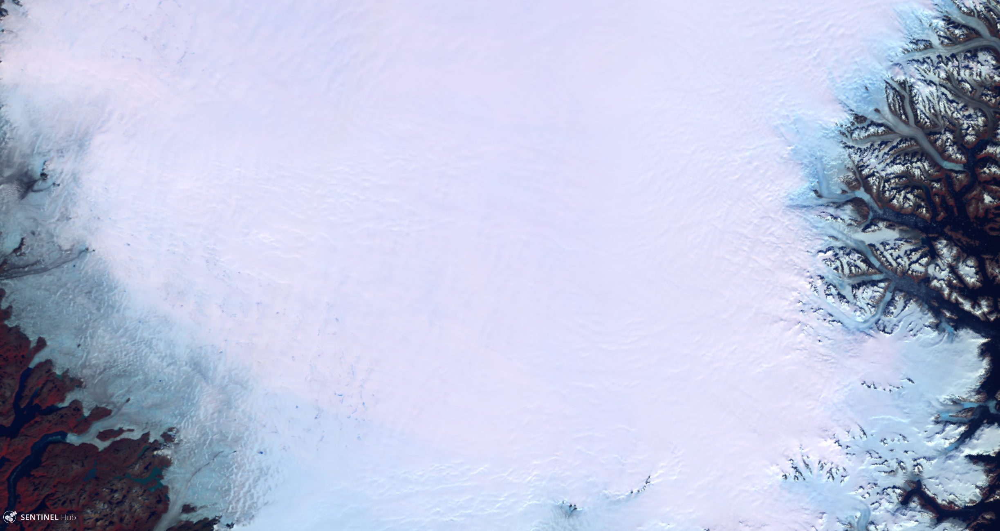

# Normalized Difference Bare ice Index, NDBI  


<button class="btn btn-primary" id="toggle-script" onclick="toggleScript()">Show Script</button>
[Download Script](script.js){: .btn target="_blank" download="{{paths | append: ".js"}}"}
{: .mt-lg-4 }

 




## Evaluate and visualize  
 - [EO Browser](https://sentinelshare.page.link/sRYg){:target="_blank"}   

## General description of the script  

The Sentinel-3 OLCI Normalized Difference Bare ice Index (NDBI) was developed by [Kokhanovsky et al. (2020)](https://www.mdpi.com/2072-4292/11/19/2280) to differentiate snow-covered surfaces from bare ice. NDBI used two bands: one in the Blue (Band 2, 412.5 nm)  and one in the NIR (Band 21, 1020 nm).  

Formula:
_(Band 02 - Band 21) / (Band 02 + Band 21)_

 The surface types corresponding to NDBI values are shown in the table below. The thresholds may be modified depending on local conditions.
    
| Values| Surface |
|--|--|
| 0--0.2 | Snow |
| 0.2--0.5 | Bare ice |
| 0.5--0.8 | Dark ice (melting) |

## Description of representative images  

1. NDBI of South Greenland, acquired on 29 August 2019.  
   
2. Classified NDBI map of South Greenland, acquired on 29 August 2019 (Light blue = snow, pink = ice, dark blue = dark ice, black = other surfaces).  
  
3. For comparison purposes: RGB (B17, B07, B03) image of South Greenland, acquired on 29 August 2019.)  
  

## Contributors:  
Maxim Lamare
