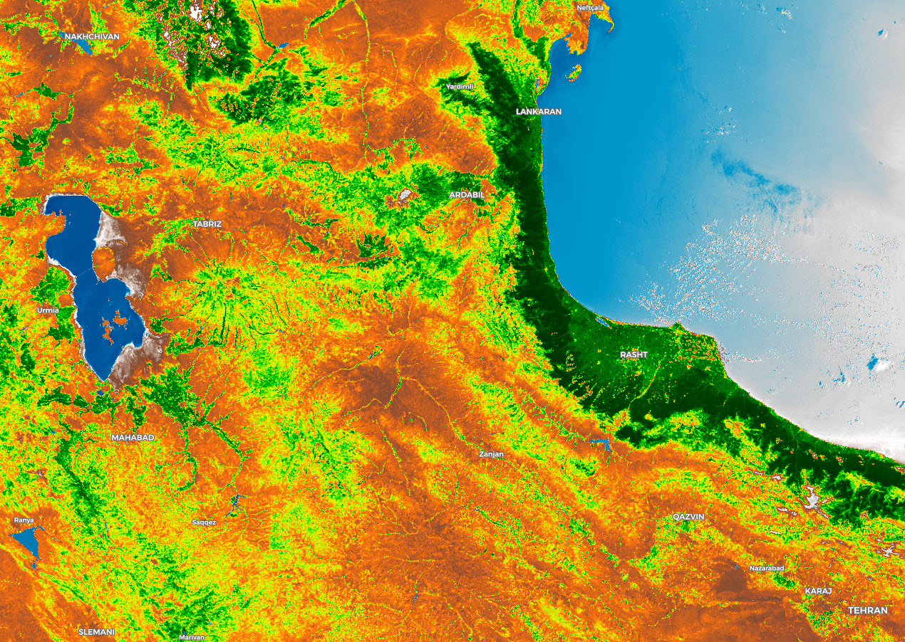

# Vegetation and Land Monitoring with Cloud Mask


<button class="btn btn-primary" id="toggle-script" onclick="toggleScript()">Show Script</button>
[Download Script](script.js){: .btn target="_blank" download="{{paths | append: ".js"}}"}
{: .mt-lg-4 }

 




## Author of the script
By TIZNEGAR Startup Co, 
[www.tiznegar.com](http://www.tiznegar.com/){:target="_blank"}

## Evaluate and Visualize

- [EO Browser](https://sentinelshare.page.link/xRUA){:target="_blank"}

## General description
Vegetation monitoring index for Sentinel 3 OLCI (VMI3) has the same functionality as NDVI, using NIR* and RED wavelengths in a normalized difference index. The script displays the vegetation index with a continuous colour scale and uses cloud mask to display clouds and snow in white. It also provides a preprepared conditional statement for land classification, by only changing the visualized range. 

The index is calculated as:

**VMI3 = (B17 - B08) / (B17 + B08)**

The range of the index is between -1 and 1: 

**-1 ≤ VMI3 ≤ 1**

The index shows a very good separation of vegetation, that can be used to monitor changes in periodic studies. Dense, high growing or good quality vegetation is displayed in bold green colors, while thin, low growing or low quality vegetation is displayed in pale green colors. Gray areas indicate high salinity or a desert, white areas are usually clouds or snow, and blue areas indicate water.

*_As the Sentinel-2 NIR equivalent with a central wavelength 832.8 nm is not available for Senitnel-3 OLCI, band 17, with a central wavelength of 865 nm, was used for the NIR part of the equation. Band 17 belongs into narrow near infrared range, similar to B8A in Sentinel-2._

## Description of representative images

[Show VMI3 index of Iran and show Gilan province and Urmia lake](https://sentinelshare.page.link/xRUA){:target="_blank"}

**The range of VMI3 index display can be changed by the user. For example:**

- `if (VMI3 > [ 0.4 ] && VMI3< [ 1 ])`

In this case, only the areas with the VMI3 index in range of 0.4 to 1 are visualized in a continuous color scale, highlighting Hyrcanian forests in Gilan and agricultural areas around Lake Urmia with green colors. Other areas are returned in true color, with cloud mask in white. [Show in EO Browser.](https://sentinelshare.page.link/9crw){:target="_blank"}

- `if (VMI3 > [ -1 ] && VMI3< [ 0 ])`

In this image, only areas with the VMI3 index range of -1 to 0 are visualized in a continuous color scale, displaying water areas in blue colors. The water levels of Lake Urmia and Sefidrud Dam in Gilan province are well visible. Other areas are returned in true color, with cloud mask in white. [Show in EO Browser.](https://sentinelshare.page.link/Hbcn){:target="_blank"}

