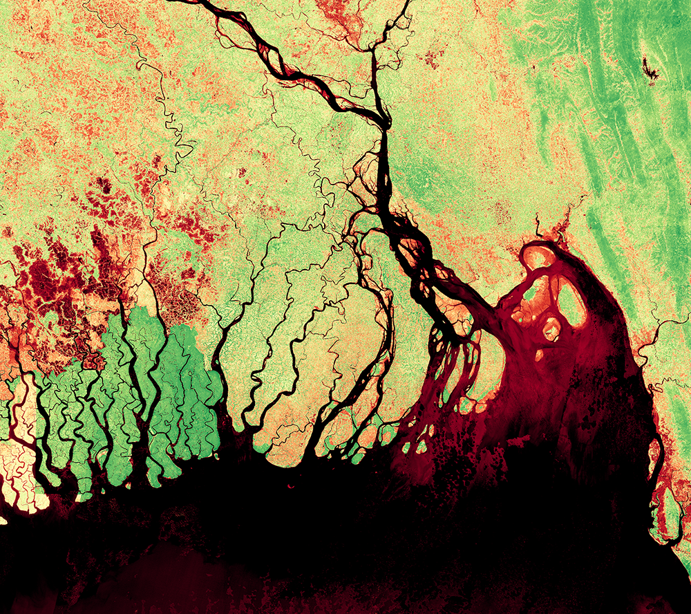

# Sentinel-2 120 m Mosaic - NDVI

<a href="#" id='togglescript'>Show</a> script or [download](script.js){:target="_blank"} it.





## Collection Access

[Sentinel-2 L2A 120 m mosaic](https://collections.sentinel-hub.com/sentinel-s2-l2a-mosaic-120/) is a [public data collection](https://collections.sentinel-hub.com/), that is not part of open EO data. It is not included into EO Browser or Sentinel Playground. To access it, you need a [Sentinel Hub account](https://www.sentinel-hub.com/pricing/), and then either create a [process request](https://docs.sentinel-hub.com/api/latest/api/process/) to the collection or to [create a configuration based on the preprepared template](https://www.sentinel-hub.com/faq/#how-to-visualize-own-collection-eobrowser), which will allow you to view it in EO Browser and make [OGC requests](https://www.sentinel-hub.com/develop/api/ogc/) to it. The collection ID is `484d8dbb-9e3e-41f2-b96b-35189d3ae37f`, and the collection type is `byoc-484d8dbb-9e3e-41f2-b96b-35189d3ae37f`. 

## General description

The well known and widely used NDVI is a simple, but effective index for quantifying green vegetation. It normalizes green leaf scattering in Near Infra-red wavelengths with chlorophyll absorption in red wavelengths.

The value range of the NDVI is -1 to 1. Negative values of NDVI (values approaching -1) correspond to water. Values close to zero (-0.1 to 0.1) generally correspond to barren areas of rock, sand, or snow. Low, positive values represent shrub and grassland (approximately 0.2 to 0.4), while high values indicate temperate and tropical rainforests (values approaching 1). It is a good proxy for live green vegetation; see [1] for details.

The normalized difference vegetation index, abbreviated NDVI, is calculated using near infrared and red wavelengths.

NDVI = (NIR - RED) / (NIR + RED)

For Sentinel-2, the NDVI is calculated using NIR band 5 and red band 4:

NDVI = (B08 - B04) / (B08 + B04)

See also [this page](https://custom-scripts.sentinel-hub.com/sentinel-2/ndwi/#).

## Description of representative images

NDVI of northern Africa and Europe, 27.12.2019. 

NDVI of Japan, 27.12.2019. 

NDVI of Ganges delta in Bangladesh, 27.12.2019.

