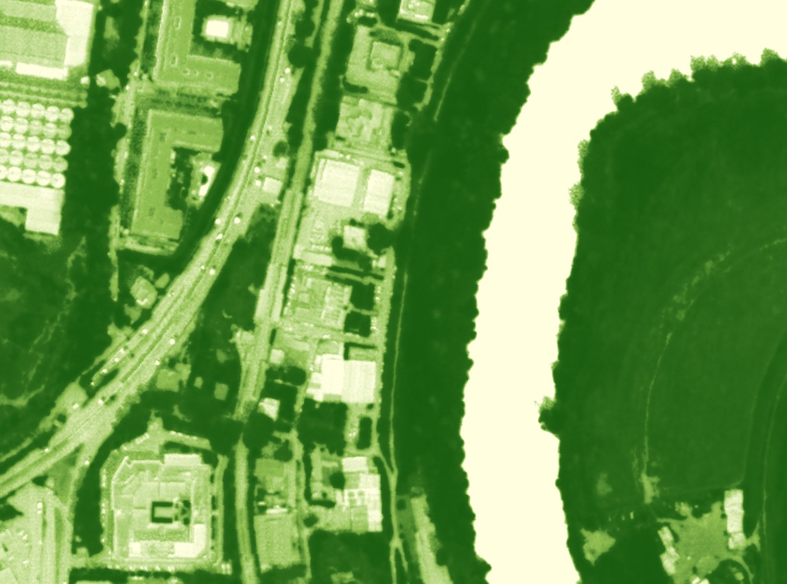

## Evaluate and visualize

As SkySat is commercial data, brought into Sentinel Hub as Bring Your Own Data, direct EO Browser links are not possible due to the personalized data credentials. 

## General description

The well known and widely used NDVI is a simple, but effective index for quantifying green vegetation. It normalizes green leaf scattering in Near Infrared wavelengths with chlorophyll absorption in red wavelengths.

The value range of the NDVI is -1 to 1. Negative values of NDVI (values approaching -1) correspond to water. Values close to zero (-0.1 to 0.1) generally correspond to barren areas of rock, sand, or snow. Low, positive values represent shrub and grassland (approximately 0.2 to 0.4), while high values indicate temperate and tropical rainforests (values approaching 1). It is a good proxy for live green vegetation; see [1] for details.

The normalized difference vegetation index, abbreviated NDVI, is defined as   

$$NDVI := \mathtt{Index}(nir,red) = \frac{nir-red}{nir+red}.$$  

The result is visualized using the `valueInterpolate` function. It maps the values of the
NDVI in certain intervals to RGBA (RGB+Alpha) values for visualization. 

## Description of representative images

NDVI visualisation over Rome, Italy, acquired on 2018/08/28.

## References
 [1] Wikipedia, [Normalized Difference Vegetation Index
](https://en.wikipedia.org/wiki/Normalized_Difference_Vegetation_Index). Accessed on October 4th 2017.
